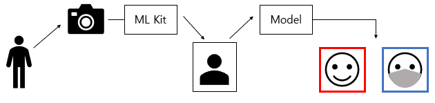
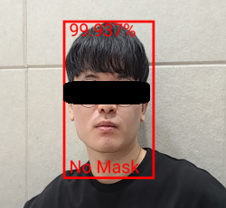
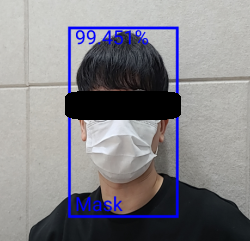

Mask Checker
============


Intro
------
2020년 제14회 공개SW 개발자 대회를 위해 제작되었습니다.

개발 기간: 2020.07.16 ~ 2020.09.03

안드로이드 기기의 카메라를 사용해 마스크 착용 여부를 검사하는 프로젝트입니다.

MobileNetV2 모델을 Tensorflow Lite 모델로 변환하여 모바일에 저장한 후
Google ML Kit을 사용해 얻은 얼굴 이미지를 모델에 입력하여 마스크 착용 여부를 검사합니다.

Model and Datasets
------------------
[MaskChecker datasets][mask_checker_dataset]

[mask_checker_dataset]: https://github.com/Onegold11/mask_checker_dataset

Architecture
------------


 구글의 ML Kit 라이브러리를 사용해 얼굴 부분만 추출하여 입력 데이터로 변환합니다. 해당 데이터를 tflite 파일로 변환된 모델에 입력하면 해당 입력 데이터가 마스크를 착용했는지 구별하고 결과를 출력합니다.


Environment
------------
+ Android Studio version: 4.0.1
+ Android minimum version: API level 23(Marshmallow)

Other open source
-----------------
+ Google ML Kit : https://github.com/googlesamples/mlkit
+ Tensorflow Lite : https://www.tensorflow.org/lite/guide
+ Auto Permissions : https://github.com/pedroSG94/AutoPermissions

Contents
--------
+ Class
  + CameraSurfaceView : 카메라 및 이미지 인식 관련 기능
  + DrawView : 얼굴 영역 화면 표시 기능
  + MainActivity : 권한 설정 및 화면 설정
  + TFLiteBitmapBuilder : 카메라 이미지를 모델 입력 데이터로 변환
  + TFLiteModel : Tensorflow 모델 관련 기능

+ Model File
  + MobileNet.tflite: Tensorflow 모델 파일

Example
-------



마스크를 착용하지 않은 경우 빨간색 상자가 얼굴 영역에 생성됩니다.

마스크를 착용한 경우 파란색 상자가 얼굴 영역에 생성됩니다.

User Manual
------
사용 가능한 기능
  + 카메라 회전 기능
    + 가로, 세로 모드 지원
    + 스마트폰 기기의 화면 전환 기능을 활성화 해야 함
  + 전면, 후면 카메라 전환 기능
    + 화면 하단 버튼을 통해 전면, 후면 카메라 전환 가능
  + 얼굴 인식 기능
    + 얼굴 영역 화면에 표시
  + 마스크 착용 여부 검사 기능
    + 착용 여부를 화면에 표시 (정확도, 얼굴 영역)
    + 일정 시간 동안 마스크 착용하지 않을 경우 알람 메시지 출력


Developer Manual
------
##### TFLiteBitmapBuilder
  ```java
  TFLiteBitmapBuilder builder = new TFLiteBitmapBuilder();
  Bitmap bitmap = builder
          .getBitmapFromPreviewImage(data, parameters)
          .rotateBitmap(CAM_ORIENTATION)
          .cropFaceBitmap(face.getBoundingBox())
          .resizeBitmap(IMAGE_SIZE, IMAGE_SIZE)
          .build();
  ```
  getBitmapFromPreviewImage()
  + SurfaceView의 onPreviewFrame 메소드의 카메라 이미지 데이터를 Bitmap 형식으로 변환
  + data : onPreviewFrame의 data
  + parameters : Camera.Parameters parameters = camera.getParameters();

setCameraFacing()
  + 전면, 후면 카메라 이미지 설정
  + 전면 카메라의 경우 이미지 좌우 반전

rotateBitmap()
  + Bitmap 이미지 데이터를 회전
  + CAM_ORIENTATION : 회전 각도, 프로젝트에서는 90 사용

cropFaceBitmap()
  + Bitmap에서 Rect 객체의 정보를 사용해 얼굴 영역만 추출
  + faces.get(i).getBoundingBox() : 얼굴 영역의 Rect 객체

resizeBitmap()
  + 이미지의 크기를 지정한 크기로 변환
  + 프로젝트에서는 128 * 128 크기의 이미지로 변환

build()
  + 변환된 이미지 반환

Q&A
---
Onegold11 : ujini1129@gmail.com

yang20202 : yang202@ajou.ac.kr
